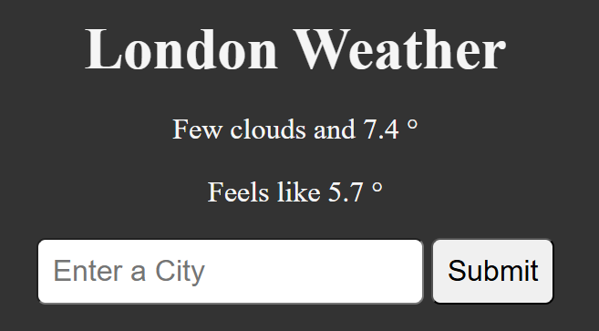

# 🌦️ Get Weather Conditions

A simple Python web app that fetches the current weather conditions for a given city using the OpenWeatherMap API.

## 📌 Features
- Fetches current weather data for any city
- Displays weather description, temperature and feels-like temp
- Uses the OpenWeatherMap API

## 🚀 Live Demo
Check it out here 👉 [py-get-weather-conditions](https://py-get-weather-conditions.onrender.com)



## 🛠️ Technologies Used
- Python
- HTML / CSS
- Flask
- Requests library
- OpenWeatherMap API
- Render (for deployment)

## 📖 How to Use Locally

1. **Clone the repository**
   ```bash
   git clone https://github.com/SilviaScivales/py-get-weather-conditions.git
   cd py-get-weather-conditions
2. **Install dependencies**
   ```bash
   pip install -r requirements.txt
3. **Get your free API key from [OpenWeatherMap](https://openweathermap.org/)**
   
5. **Run the app**
   ```bash
   python app.py
6. **Open your browser and go to http://localhost:8000**
